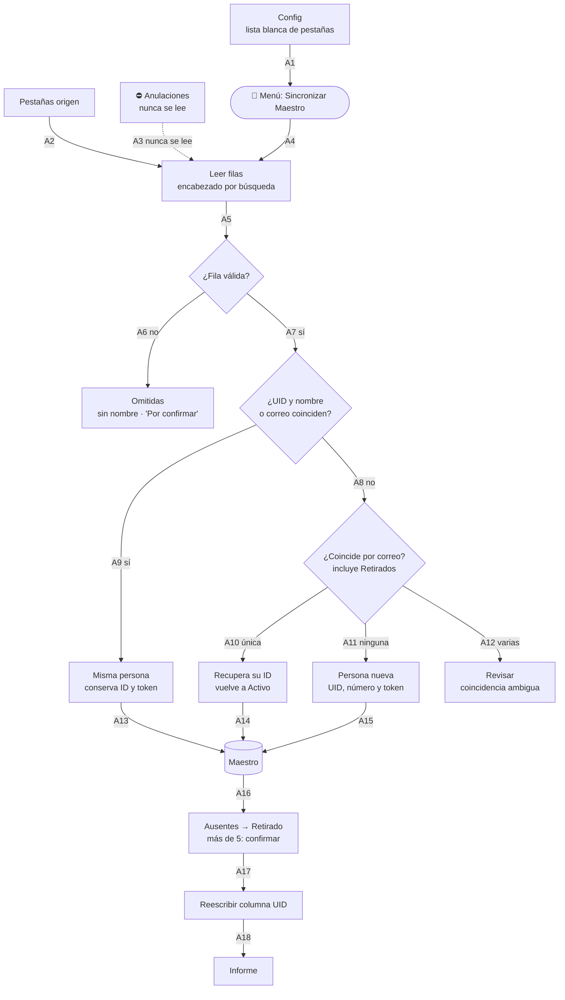
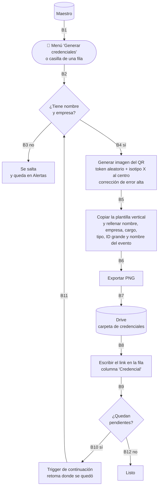
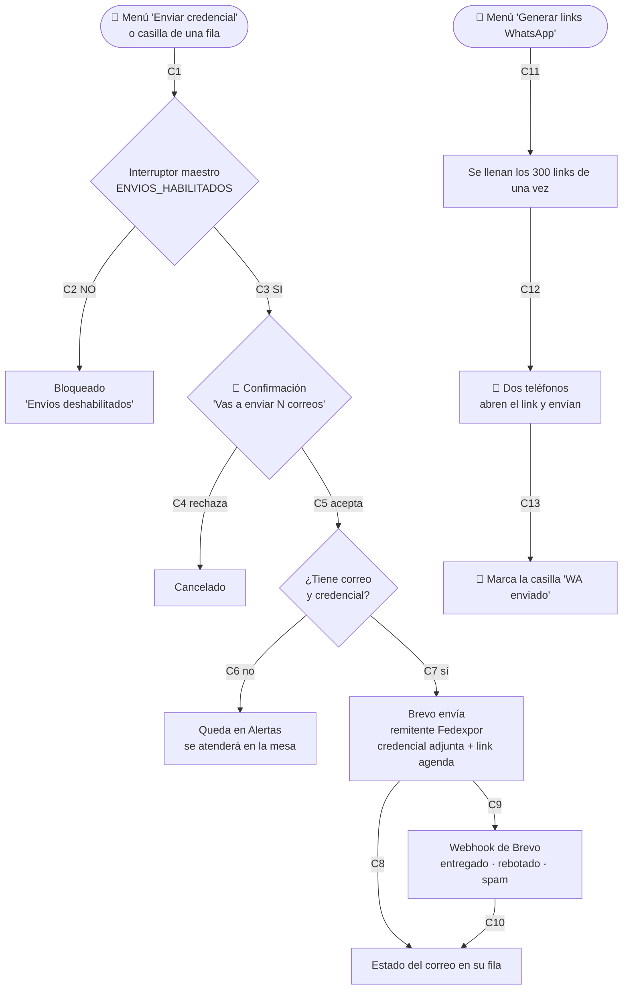
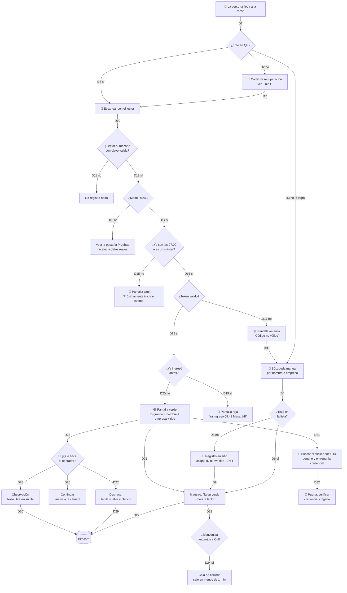
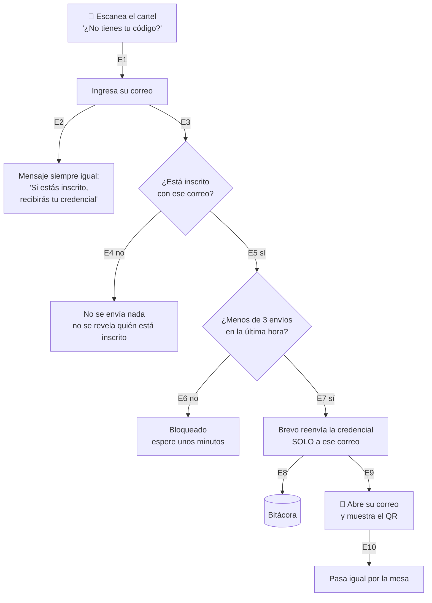
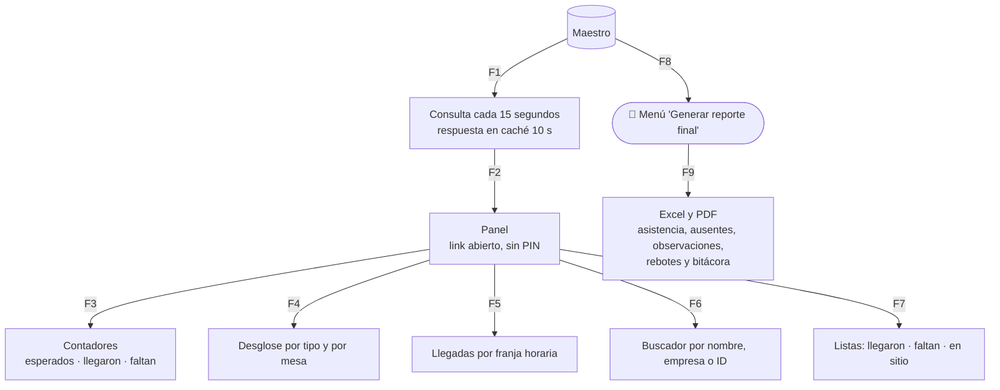

# Flujograma del sistema · XVIII Convención de Exportadores

Cada flecha está numerada. Para corregir algo, cítame el número de la arista (por ejemplo "cambia D7") y lo ajusto.

**Leyenda de responsables:** 🧑 Responsable Fedexpor · 🤖 Sistema · 👥 Equipo de mesa · 🧍 Asistente

---

## Flujo A · Cargar y sincronizar la lista

El sistema reconoce a cada persona aunque su fila se **mueva**, se **borre** o se **corte a Anulaciones**. La columna UID es solo una pista: se verifica con el nombre y el correo, y se repara sola en cada sincronización.

| # | Qué pasa exactamente | Si falla |
|---|---|---|
| **A1** | Se leen las pestañas declaradas en la lista blanca de Config. | Si Config está vacío, no corre y avisa. |
| **A2** | Solo pestañas declaradas. Filas ocultas o filtradas **sí se leen**: filtrar no hace desaparecer a nadie. | — |
| **A3** | Anulaciones nunca se lee. Cortar a alguien de Pagados y pegarlo ahí lo hace desaparecer, y pasa a Retirado en A16. | — |
| **A4** | Arranca a mano. Nunca por fecha ni por trigger. | — |
| **A5** | Busca la fila con el encabezado «Nombre» y localiza columnas por su texto. | Encabezado faltante o pestaña inexistente: **se detiene**. Nunca retira a sus personas. |
| **A6** | Nombre vacío o «Por confirmar»: se omite y se reporta. | — |
| **A7** | Fila válida: hay que reconocer a quién pertenece. | — |
| **A8** | Sin UID, o UID desalineado: cambiaron **a la vez** nombre y correo. Pasa al mover solo celdas visibles o escribir encima de otra persona. | — |
| **A9** 🔴 | UID existe y coincide nombre **o** correo: misma persona, **conserva su número y token**. | Si el número cambiara al editar datos, los stickers impresos no servirían. |
| **A10** | Coincide por correo (o correo + nombre si es compartido, o nombre + empresa si no tiene correo), **incluso si estaba Retirada**: recupera su número original. | Es el caso del borrado por error y reescrito a mano. Sin esto, habría duplicados. |
| **A11** | No coincide con nadie: persona nueva, siguiente número. Los números nunca se reutilizan. | — |
| **A12** | Más de un candidato: no adivina, queda en Alertas. | — |
| **A13–A15** | Se escribe en el Maestro por lotes y con bloqueo. | — |
| **A16** | Quien no apareció en ninguna pestaña pasa a **Retirado**: fuera de envíos, conteo y panel. **Una llegada registrada nunca se revierte.** | Más de 5 retirados de golpe: pausa y pide confirmación con nombres. |
| **A17** | Se reescribe la columna UID en todas las filas. La desalineación se repara sola. | — |
| **A18** | Informe: leídas, omitidas, nuevas, recuperadas y retiradas, con nombre. | — |

---

## Flujo B · Generar la credencial

| # | Qué pasa exactamente | Si falla |
|---|---|---|
| **B1** | Se trabaja sobre las filas activas del Maestro, nunca sobre las pestañas origen. | — |
| **B2** | Se dispara a mano: todos los pendientes, solo la selección, o una sola fila. | — |
| **B3** | Sin nombre o sin empresa no hay credencial. Queda registrado en Alertas. | — |
| **B4** | Datos suficientes para el diseño. El correo **no** es requisito: puede tener credencial y recibirla en la mesa. | — |
| **B5** | El QR codifica un link con el token. **Nunca el ID, el nombre ni el correo.** | Si el servicio de QR no responde, reintenta 3 veces y marca error en esa fila. |
| **B6** | Se copia la plantilla y se reemplazan los textos. El ID va en grande porque es lo que la mesa busca. | — |
| **B7** | Se guarda como `47P - Nombre Apellido.png`, con permiso de lectura por link. | — |
| **B8** | El link queda en la fila de esa persona. | — |
| **B9–B11** | Apps Script corta cada ejecución a los 6 minutos. El proceso trabaja en lotes de 5 minutos, guarda su avance y continúa solo. | Si se corta, al reanudar no repite las ya generadas. |
| **B12** | Fin. Te informa cuántas generó y cuántas fallaron. | — |

---

## Flujo C · Enviar credenciales

| # | Qué pasa exactamente | Si falla |
|---|---|---|
| **C1** | Todo envío es manual. **No hay ningún correo programado por fecha.** | — |
| **C2** | El interruptor arranca en NO. Con NO, ninguna ruta del sistema puede enviar, ni siquiera por error. | Escribe "Envíos deshabilitados" en la fila. No envía nada. |
| **C3** | Solo tú lo cambias a SÍ, desde el menú. Se recomienda volverlo a NO al terminar cada tanda. | — |
| **C4 / C5** | Antes de un envío masivo te muestra cuántos van, con qué plantilla y quiénes quedan fuera. | — |
| **C6** | Sin correo o sin credencial no se envía. Esas personas llegarán sin QR y se atienden en la mesa. | — |
| **C7 / C8** | Sale por Brevo desde el correo institucional. La credencial va adjunta y también incrustada. | Si Brevo rechaza, guarda el error en la fila y sigue con el siguiente. No corta la tanda. |
| **C9 / C10** | Brevo avisa después si el correo se entregó o rebotó. Eso permite corregir direcciones antes del evento. | — |
| **C11** | Los links de WhatsApp se generan todos juntos, cuando tú lo pidas. Antes de eso la columna está vacía. | Si el celular no se puede normalizar a +593, marca "Celular inválido". |
| **C12 / C13** | Envío manual desde dos teléfonos, unos 150 cada uno. WhatsApp no permite adjuntar por esta vía, así que va el link. | — |

---

## Flujo D · El día del evento (el flujo crítico)

| # | Qué pasa exactamente | Si falla |
|---|---|---|
| **D1** | Una sola entrada, dos mesas, cuatro lectores. | — |
| **D2** | Si no tiene el QR, se le señala el cartel de recuperación que está en la fila. | — |
| **D3** | Si no puede recuperarlo (sin batería, sin datos, sin acceso al correo), el operador lo busca a mano. | — |
| **D4 / D5** | Búsqueda por nombre o empresa dentro del lector. | — |
| **D5** | No está en ninguna lista: registro en sitio. Recibe un ID nuevo con sigla **NR** y sticker escrito a mano. | — |
| **D6** | Está en la lista pero sin QR: se marca llegada igual, con origen "Manual". | — |
| **D7 / D8** | El escaneo solo ocurre en la mesa, nunca en la puerta. | — |
| **D9** | El registro en sitio marca llegada de inmediato y encola su credencial y bienvenida. | — |
| **D10 / D11** | **La arista de seguridad más importante.** Si el QR se escanea con la cámara común del celular, se abre una página informativa que **no escribe nada**. Solo un lector con clave válida puede registrar. | Sin clave, el lector no deja pasar de la pantalla de configuración. |
| **D12 / D13** | En modo PRUEBA todo funciona igual pero se guarda aparte. Sirve para el simulacro del lunes sin ensuciar datos. | — |
| **D14 / D15** | Los operadores no pueden registrar antes de las 07:00. Los dos lectores máster sí, siempre. | — |
| **D16 / D17** | Se valida el token contra el padrón. Un QR inventado o ajeno al evento cae aquí. | — |
| **D18 / D19** | Si el token ya fue usado, sale rojo con la hora y la mesa donde entró. Evita la doble entrega de credencial. | — |
| **D20 / D21** | Verde a pantalla completa con sonido y vibración. **El registro ya está hecho cuando aparece el verde**, no se espera confirmación. | Sin señal, valida contra el padrón local y guarda en cola. Sincroniza al volver la conexión. |
| **D22** | Todo queda en la bitácora: hora, lector, acción. Nada se borra nunca. | — |
| **D23 / D24** | La bienvenida tiene su propio interruptor, independiente del maestro. Si está apagado, el ingreso se registra igual. | El lector **nunca espera** al correo. Va por cola. |
| **D25–D28** | Tres botones tras el verde: continuar, deshacer, observación. | — |
| **D27 / D29** | Deshacer devuelve la fila a blanco. Los operadores pueden deshacer sus últimos 5, dentro de 10 minutos. Los máster, cualquiera. | — |
| **D31 / D32** | El operador busca el sticker por el número, lo pega y entrega. En la puerta solo se verifica que la lleve puesta. | Si el ID es tipo NR, el lector avisa "sticker a mano". |
| **D33** | Un código inválido siempre deriva a búsqueda manual. Nunca se deja a alguien afuera por un QR que no leyó. | — |

---

## Flujo E · Recuperar la credencial en la fila

| # | Qué pasa exactamente | Por qué |
|---|---|---|
| **E1** | Un QR impreso al inicio de la fila abre esta página. Nada que instalar. | — |
| **E2** | El mensaje es el mismo exista o no el correo. | Si dijera "no estás inscrito", cualquiera podría averiguar quién asiste. |
| **E3 / E4** | Si el correo no está en la lista, no se envía nada, pero la pantalla no lo delata. | — |
| **E5 / E6** | Máximo tres reenvíos por hora y por dirección. | Evita que alguien sature el buzón de otra persona. |
| **E7** | **Sin código de verificación.** Brevo reenvía la credencial directamente a la dirección registrada. El QR nunca se muestra en pantalla. | Nadie puede obtener la credencial de otro escribiendo su correo: el archivo solo llega al buzón del titular. |
| **E8** | Cada reenvío queda en la bitácora, con hora y correo. | — |
| **E9** | La persona abre el mensaje en su celular y muestra el QR. Si el correo tiene dos inscritos, van las dos credenciales en el mismo mensaje, cada una con su nombre. | Por eso ya no hace falta la pantalla de "elige tu nombre". |
| **E10** | Recuperar la credencial **nunca marca llegada.** | Solo los lectores de la mesa registran asistencia. |

> **Límite conocido:** este camino exige que la persona pueda abrir su correo en la fila. Quien no pueda (sin datos, sin batería, sin acceso al buzón) se atiende por **búsqueda manual** desde el lector, que es la arista **D5**.

---

## Flujo F · Panel en vivo y reporte

| # | Qué pasa exactamente | Nota |
|---|---|---|
| **F1** | El panel lee del Maestro, no escribe nunca. | Un espectador no puede alterar nada. |
| **F2** | La respuesta se guarda en caché 10 segundos. | Sin esto, 20 personas mirando el panel saturan el sistema y el lector se pone lento. |
| **F3–F7** | Todo responsive, móvil y computador. | **No muestra correo ni celular**, porque el link es abierto. |
| **F8 / F9** | El reporte se genera cuando lo pidas, las veces que quieras. | — |

---

## Las cinco aristas donde el sistema se cae si están mal

1. **D10** · Si cualquiera pudiera registrar llegadas, el conteo pierde todo valor. Es el error que ocurrió en tu evento anterior.
2. **A9** · Si la misma persona cambiara de número al editar sus datos o al mover su fila, los stickers impresos dejarían de servir.
3. **C2** · Sin el interruptor maestro, un clic accidental envía 300 correos que no se pueden deshacer.
4. **D20** · Si el lector esperara la respuesta del servidor para mostrar el verde, la fila se detendría con cada segundo de latencia.
5. **F2** · Sin caché, el panel compite con los lectores por el mismo recurso y ambos se vuelven lentos justo en la hora pico.
